# Ejercicio 1

## Índice
- [Ejercicio 1](#ejercicio-1)
  - [Índice](#índice)
  - [Descripción](#descripción)
  - [Elementos y su configuración](#elementos-y-su-configuración)
    - [Grupo de recursos](#grupo-de-recursos)
    - [Red virtual y subredes](#red-virtual-y-subredes)
    - [IPs públicas](#ips-públicas)
    - [Grupos de seguridad de red](#grupos-de-seguridad-de-red)
    - [Máquinas virtuales](#máquinas-virtuales)
  - [Comprobación y funcionamiento de la infraestructura](#comprobación-y-funcionamiento-de-la-infraestructura)
    - [Acceso por SSH](#acceso-por-ssh)
    - [Servidor web nginx](#servidor-web-nginx)
    - [Servidor de backend nuestra "app"](#servidor-de-backend-nuestra-app)
    - [Comprobar el acceso a nuestra "app" desde el frontned](#comprobar-el-acceso-a-nuestra-app-desde-el-frontned)
    - [Denegar comunicaciones con nuestro backend](#denegar-comunicaciones-con-nuestro-backend)

## Descripción

En este ejercicio realizaremos la siguiente infraestructura en Azure, que consta de dos servidores virtuales, uno actuando como frontend y otro como backend.

Con este ejercicio, comprobaremos el funcionamiento y conceptos de las comunicaciones por red, permitiendo y luego denegando estas comunicaciones.

El esquema de lo que crearemos, es el siguiente:

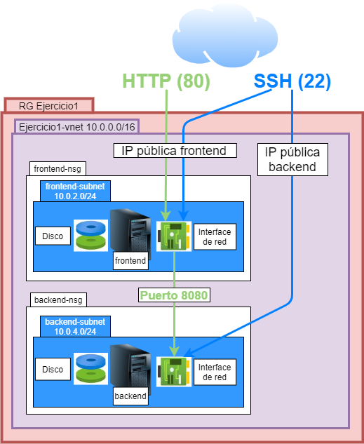

## Elementos y su configuración

### Grupo de recursos

- __Nombre__: Ejercicio1

    Para contener a nuestra infraestructura necesitamos agrupar todos sus elementos bajo un grupo de recursos.

### Red virtual y subredes

Para tener comunicación entre los diferentes elementos de nuestra infraestructura, debemos tener una red virtual que nos lo permita, por ello tendremos que crear una (Ejercicio1-vnet).

- __Nombre__: Ejercicio1-vnet
- __Rango de IPs__: 10.0.0.0/16

Además, para facilitar el control de tráfico de la red, crearemos dos subredes para poder tener en cada una de ellas, dos roles distintos de servidores con sus reglas distintas de comunicaciones. Estas serán frontend-subnet y backend-subnet.

- __Subredes__: crearemos dos subredes, una para cada rol de nuestros servidores.
  - Rol de frontend
    - __Nombre__: frontend-subnet
    - __Rango de IPs__: 10.0.2.0/24
  - Rol de backend
    - __Nombre__: backend-subnet
    - __Rango de IPs__: 10.0.4.0/24

### IPs públicas

Necesitaremos dos IPs públicas, para poder acceder desde internet a nuestra infraestructura, una para acceder al servidor de rol de frontend y otra para el de backend.

- IP pública frontend
    - __Nombre__: frontend-ip

- IP pública backend
    - __Nombre__: backend-ip

### Grupos de seguridad de red

Debemos tener dos grupos de seguridad de red (network security group) diferenciados, para cada uno de los roles, los cuales aplicaremos a cada subred.

- Grupo de seguridad para el rol de frontend
  - __Nombre__: frontend-nsg
    - __Comunicaciones permitidas__:
      - __Origen__: Internet
        - __Puertos__: HTTP(80) y SSH(22)
  - __Nombre__: backend-nsg
      - __Comunicaciones permitidas__:
        - __Origen__: Internet
          - __Puerto__: SSH(22)
        - __Origen__: sólo la red virtual Ejercicio1-vnet
          - __Puerto__: 8080

### Máquinas virtuales

Crearemos dos máquinas, una por cada rol que queremos que desempeñen, por tanto al crearlas tendremos que tener en cuenta a que subred y grupo de seguridad, deben estar asociadas.

- Rol de frontend
  - __Nombre__: frontend
  - __Imagen__: cualquiera Ubuntu Linux
  - __Red virtual__: Ejercicio1-vnet
  - __Subred__: frontend-subnet
  - __Grupo de seguridad de red__: frontend-nsg
  - __IP pública__: frontend-ip

- Rol de backend
  - __Nombre__: backend
  - __Imagen__: cualquiera Ubuntu Linux
  - __Red virtual__: Ejercicio1-vnet
  - __Subred__: backend-subnet
  - __Grupo de seguridad de red__: backend-nsg
  - __IP pública__: backend-ip

## Comprobación y funcionamiento de la infraestructura

### Acceso por SSH

Accederemos a ambas máquinas, con el comando SSH, de la siguiente manera:

```
ssh -l <usuario> <ip_pública_frontend>
```

Un ejemplo de lo anterior sería:

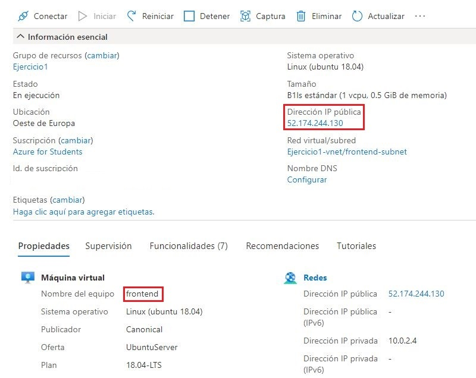

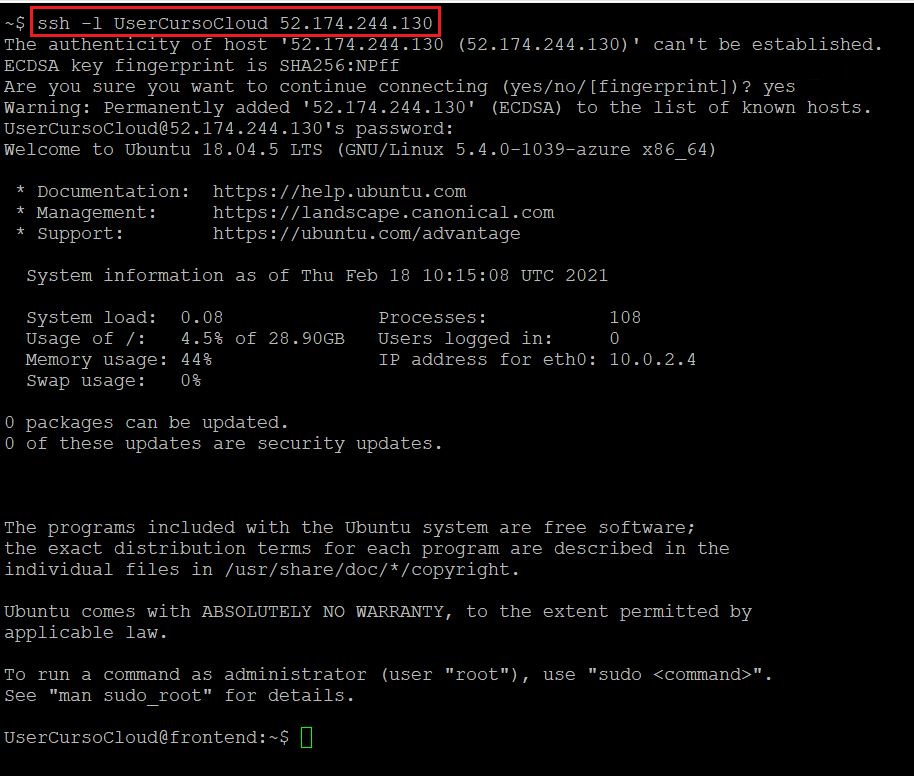

### Servidor web nginx

Instalaremos este servidor web en la máquina frontend y comprobaremos que somos capaces de acceder a la página web, que muestra por defecto.

Por ello, estando dentro como hemos accedido antes por SSH, ejecutaremos el siguiente comando para la instalación:

```
sudo apt install nginx
```

Una vez haya finalizado, sólo tenemos que poner la IP pública en un navegador web, para que nos muestre lo siguiente y comprobar que está funcionado:

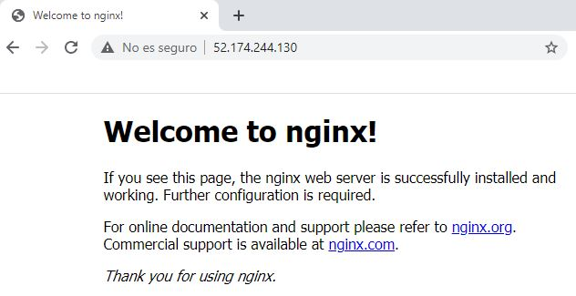

### Servidor de backend nuestra "app"

Ahora imitaremos tener una aplicación en nuestro servidor de backend, lo que haremos es levantar un servidor simple de HTTP con python y que nos muestre un fichero de texto.

Lo único que tendremos que hacer, es con el acceso por SSH que hemos hecho antes al servidor de backend, ejecutar los dos siguientes comandos:

```
echo "Servidor de backend, ¡funciona!" > prueba.txt
python3 -m http.server 8080
```

Dejaremos el último comando ejecutándose, mientras hacemos las siguientes comprobaciones.

### Comprobar el acceso a nuestra "app" desde el frontned

Podemos comprobar que nuestro frontend es capaz de acceder y mostrar lo que tenemos ejecutándose en nuestro backend, con una prueba muy sencilla desde el mismo acceso por SSH que hemos hecho antes.

Para ello, tenemos que mirar en las características de nuestra máquina de backend, la ip privada que le ha sido asignada de manera automática y ejecutar el siguiente comando:

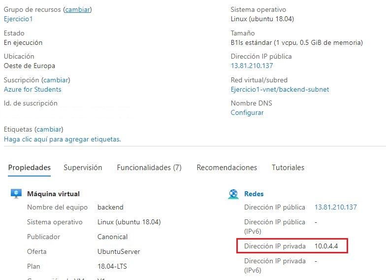

```
curl http://<ip_privada_backend>:8080/prueba.txt
```

Si funciona, deberíamos ver lo siguiente:

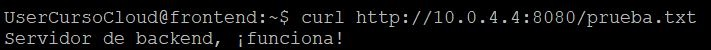

Muy bien, ya para comprobar que podemos hacer que nuestra "app" se vea desde internet, realizaremos el siguiente cambio de configuración en el nginx que hemos instalado en el frontend.

Con esta configuración, seremos capaces de llegar hasta nuestro backend, pasando por el frontend. Para ello tenemos que editar el fichero de configuración de nginx, con el siguiente comando:

```
sudo nano /etc/nginx/sites-available/default
```

Luego tendremos que añadir las siguientes líneas de configuración, justo después de donde está un apartado que empieza por Location /

```
        location /myapp {
                proxy_pass http://<ip_privada_backend>:8080/;
        }
```

Aquí podéis ver como quedaría el fichero de configuración, tras añadir estas tres líneas, con la IP del ejemplo anterior:

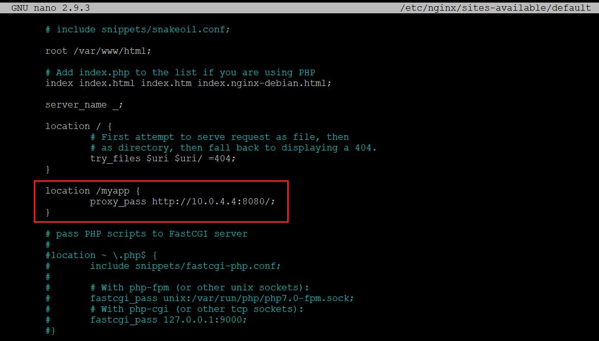

Una vez hecha la configuración y guardados los cambios en el fichero (salid con Control-X y responder con Y para salir salvando los cambios), tendremos que reiniciar nginx para que los tenga en cuenta, con el siguiente comando:

```
sudo systemctl restart nginx
```

Una vez hecho esto, si en el navegador de antes, donde hemos comprobado que nginx nos funcionaba, ponemos la URL de la siguiente manera, nos tendrá que mostrar el mismo mensaje que cuando hemos hecho el curl:

```
http://<ip_pública_frontend>/myapp/prueba.txt
```

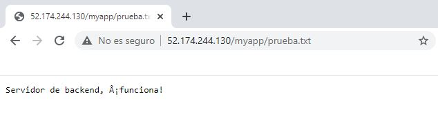

### Denegar comunicaciones con nuestro backend

Ahora vamos a probar a hacer que deje de funcionar, lo que hemos creado. Simplemente para comprobar que en un grupo de seguridad de red, podemos crear reglas que nos permiten o deniegan las conexiones.

Para ello, iremos al elemento backend-nsg, al apartado _Reglas de seguridad de entrada_ y ahí agregaremos una con los datos que se muestran a continuación. El último parámetro que es el nombre, le podemos poner el que queramos, como por ejemplo Port_8080_frontend_deny:

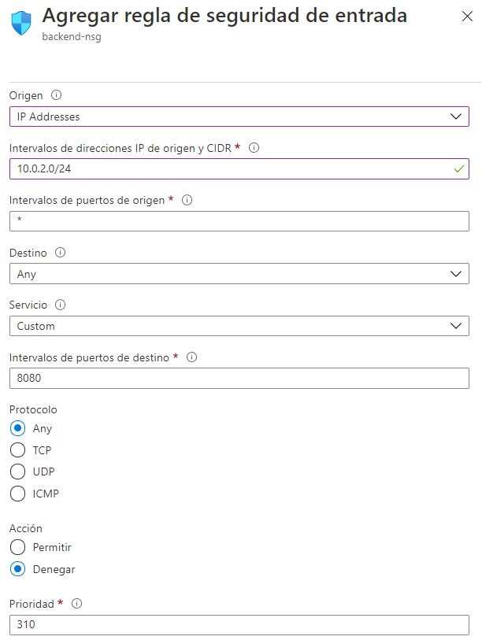

Una vez añadida, las reglas deberían quedarnos de esta manera:

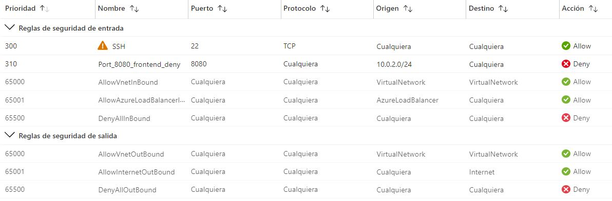

Con esta regla, lo que hemos hecho es denegar la conexión a todas las IPs de la subred 10.0.2.0/24, que corresponde a la subred de frontend que hemos creado.

Ahora si refrescamos el navegador, veremos que nos seguirá mostrando el mensaje, al menos durante un tiempo, ya que esto no se aplica instantánemente.

Pasado el tiempo que tiene para aplicarse y ser efectiva esta regla, comprobaremos que la comunicación se ha interrumpido y que nginx nos mostrará el siguiente error:

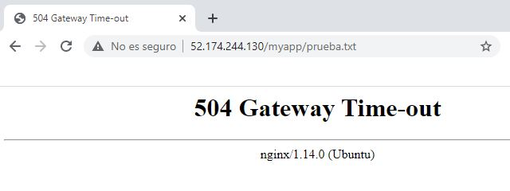