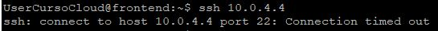
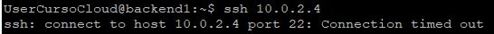
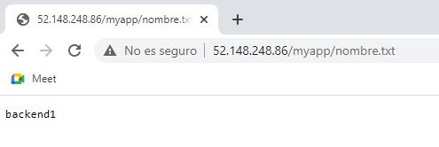
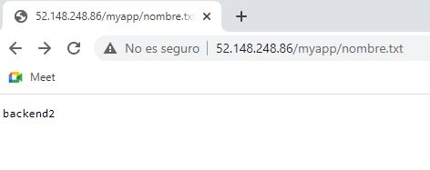

# Evualuación de la práctica

## Índice
- [Evualuación de la práctica](#evualuación-de-la-práctica)
  - [Índice](#índice)
    - [Preparación.](#preparación)
    - [Parte 1](#parte-1)
    - [Parte 2](#parte-2)
    - [Parte 3](#parte-3)
    - [Parte 4](#parte-4)

El método para evaluar la práctica será distinto dependiendo de cada parte, siendo las partes 1, 3 y 4 evaluadas presencialmente ese día en clase. La parte 2 tendrá como límite para su entrega el mismo día en Alud y se evaluará a partir del día de la entrega.

### Preparación.

El día de la evaluación de la práctica, antes de nada y cuanto antes, tendremos que tener nuestras infraestructura con todas nuestras máquinas levantadas y funcionando.

También deberemos tener una sesión por SSH establecida y al mismo tiempo, a cada una de las máquinas de nuestra infraestructura: frontend, backend1, backend2 (si hemos realizado hasta la parte 4 de la práctica) y pasarela.

También tendremos que tener la simulación de nuestra aplicación ejecutándose en todas las máquinas de backend que tengamos, según si hacemos o no hasta la parte 4, según se describe en [este punto](Configuración.md#servidor-de-backend-nuestra-app-backend) de configuración.

### Parte 1

Las siguientes serán las pruebas que evaluarán que esta parte la hemos realizado correctamente y funciona. Se podrán solicitar todas o parte de esta lista, durante la evaluación de esta parte:

1. Mostrar nuestra instalación en Azure, donde se tienen que ver todos los elementos creados, con el grupo de recursos el cual su nombre son nuestras iniciales.
2. Conexión SSH a la máquina **pasarela**. Debemos mostrar como estamos con la conexión establecida y se puede ver el nombre del servidor.
3. Conexión SSH a la máquina **frontend**, a través de la pasarela. Debemos mostrar como estamos con la conexión establecida y se puede ver el nombre del servidor.
4. Conexión SSH a la máquina **backend1**, a través de la pasarela. Debemos mostrar como estamos con la conexión establecida y se puede ver el nombre del servidor.
5. Comprobación que la conexión SSH dentro de nuestra red virtual, únicamente se permite desde la máquina pasarela, al resto de máquinas. El que funciona, lo tenemos ya comprobado en los puntos 1, 2 y 3 de esta lista. Pero para comprobar que es el único tráfico permitido, tendrá que pasar las siguiente pruebas:

     - Que no está permitida la conexión ssh desde el frontend, al backend1, con el comando `ssh <ip_privada_backend1>`, tras unos segundos de intento, debe devolvernos un error como el siguiente:

        

     - Que no está permitida la conexión ssh desde el backend1, al frontend, con el comando `ssh <ip_privada_frontend>`, tras unos segundos de intento, debe devolvernos un error como el siguiente:

        
6. Funcionamiento del servidor web nginx desde internet, mediante un navegador web con la URL `http://<ip_pública_frontend>`, debe mostrarnos la página de bienvenida de nginx:
  
    

7. Funcionamiento de nuestra aplicación simulada, accesible desde internet mediante la URL `http://<ip_pública_frontend>/myapp/nombre.txt`, nos debe aparecer el texto con el nombre de la máquina backend1:

    

8. Procederemos a parar la máquina backend1 y comprobar que si repetimos el punto anterior, nos devuelve un error similar a este:

    


### Parte 2

Se deben aportar a través de Alud, el fichero (o ficheros) de terraform (*.tf) con el código para crear la infraestructura de la parte 1 y que debe pasar las mismas pruebas de esa prueba.

La evaluación de la parte 2 será el poder ejecutar los comandos de terraform que realice:

1. La inicialización de nuestro proyecto:

    ```
    terraform init
    ```

2. El plan de ejecución:

    ```
    terraform plan
    ```

3. La creación de la infraestructura en Azure:

    ```
    terraform apply
    ```

4. Y la eliminación de la misma:

    ```
    terraform destroy
    ```

### Parte 3

En este punto, con el elemento extra del balanceador, se deberán pasar las mismas pruebas del parte 1. Además, se comprobará el siguiente punto:

1. Que la configuración de nginx, tiene puesta la IP privada del balanceador, demostrando que se está utilizando para la comunicación desde el frontend a la aplicación:

    ```
    cat /etc/nginx/sites-available/default
    ```

### Parte 4

En este punto, comprobaremos con el balanceador de la parte 3 y la segunda máquina de backend, que nuestra infraestructura pasa las pruebas de la parte 1 y 3, además de lo siguiente:

1. Cuando realicemos la comprobación número siete de la primera parte (`http://<ip_pública_frontend>/myapp/nombre.txt`), podremos tener dos respuestas distintas usando la misma URL, de acuerdo a si el balanceador dirige nuestra petición a la máquina backend1:

    

    O a la máquina backend2:

    

2. Una vez nos haya respondido una de las dos máquinas (p. ej. backend2), procederemos a apagarla, refrescando el navegador. Si todo está correcto y la comunicación está correctamente configurada a través del balanceador, al volver a refrescar la página de nuestro navegador nos debe aparecer el nombre de la otra máquina (siguiendo el mismo ejemplo, sólo nos podrá aparecer ya el nombre de backend1).
3. Y una vez también nos haya respondido la segunda máquina en el punto anterior (continuando con el ejemplo anterior, que nos responde únicamente backend1), la apagaremos también para obtener el mismo error que en el punto 6 de la parte 1, al no tener ya ninguna de las dos máquinas de backend arrancadas.