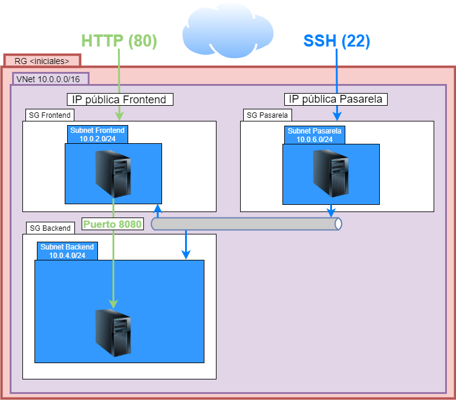
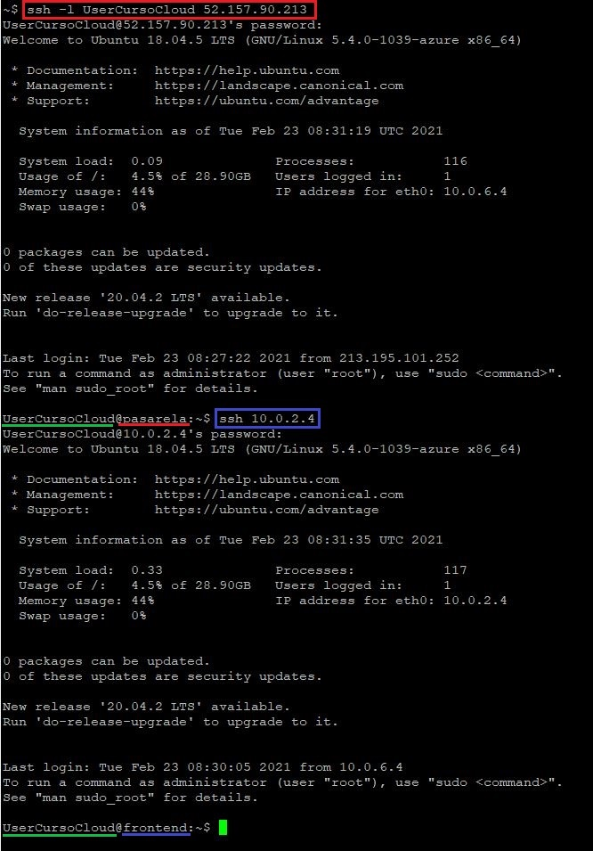
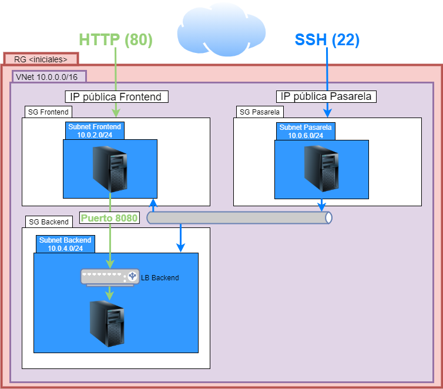
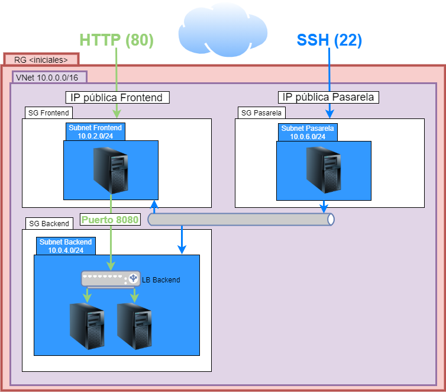

# Práctica

## Índice
- [Práctica](#práctica)
  - [Índice](#índice)
    - [Descripción](#descripción)
    - [Evaluación](#evaluación)
    - [Parte 1: creación de la siguiente infraestructura base](#parte-1-creación-de-la-siguiente-infraestructura-base)
      - [*Detalles de la infraestructura*](#detalles-de-la-infraestructura)
      - [*Conexión SSH a través de la pasarela*](#conexión-ssh-a-través-de-la-pasarela)
      - [*Configuración post instalación*](#configuración-post-instalación)
    - [Parte 2: automatización con Terraform](#parte-2-automatización-con-terraform)
    - [Parte 3: primer elemento extra, balanceador de carga](#parte-3-primer-elemento-extra-balanceador-de-carga)
    - [Parte 4: segundo elemento extra, segundo servidor de backend](#parte-4-segundo-elemento-extra-segundo-servidor-de-backend)
      - [*Configuración post instalación*](#configuración-post-instalación-1)

### Descripción

En la siguiente práctica, tendremos que llevar a cabo la creación de una infraestructura en la nube de Azure. La práctica se dividirá en las siguientes partes, con el peso indicado en la nota:

1. (50%) Parte 1: creación de la infraestructura base solicitada, por el medio que queramos.
2. (30%) Parte 2: automatizar la creación de la misma infraestructura del punto anterior, mediante Terraform.
3. (10%) Parte 3: añadiremos a la infraestructura, un balanceador de carga en la subred de backend.
4. (10%) Parte 4: añadiremos un segundo servidor en la capa que actúa el balanceador de carga, dando servicio a través del mismo.

### Evaluación

Según las partes que se lleguen a completar, se llevará a las comprobaciones descritas en el [siguiente enlace](Evaluación.md), para su evaluación y puntuación. Son las mismas comprobaciones que podéis realizar por vuestra cuenta, para saber si está todo funcionando correctamente.

### Parte 1: creación de la siguiente infraestructura base

Crear en Azure la siguiente infraestructura, con los detalles y requerimientos que hay a continuación:



#### *Detalles de la infraestructura*

De acuerdo con el esquema anterior, nuestra infraestuctura debe cumplir, al menos, con los siguientes criterios. El resto podréis decidirlos según el vuestro, como es el caso de la ubicación de los recursos.

- __Grupo de recursos__: como nombre las iniciales de nuestro nombre y apellidos.
- __Red virtual__: una red para toda nuestra infraestructura, con los siguientes datos:
  - Nombre: *inicales*-vnet
  - Rango: 10.0.0.0/16
- __Subredes__: dentro de la red virtual, debemos tener tres subredes:
  - frontend-subnet: 10.0.2.0/24
  - backend-subnet: 10.0.4.0/24
  - pasarela-subnet: 10.0.6.0/24
- __Grupos de seguridad de red__: tendremos que crear tres, uno por cada rol de nuestros servidores:
  - __frontend-nsg__: este grupo de seguridad será para el servidor con este rol y sólo permitirá las siguientes comunicaciones:
    - __Reglas de entrada__
      - Nos debe permitir conectarnos por el puerto HTTP (80) desde internet.
      - Permitiremos conexiones por el puerto SSH (22), __únicamente__ desde la subred de la pasarela, denegando el resto.
  - __backend-nsg__: este grupo de seguridad será para los servidor con este rol y sólo permitirá las siguientes comunicaciones:
    - __Reglas de entrada__
      - Permitiremos conexiones por el puerto SSH (22), __únicamente__ desde la subred de la pasarela, denegando el resto.
  - __pasarela-nsg__: este grupo de seguridad será para el servidor que actuará como pasarela, para poder conectarnos al resto de servidores de nuestra red:
    - __Regla de entrada__
      - Nos debe permitir conectarnos por el puerto SSH (22) desde internet.
- __Máquinas virtuales__:
  - Máquina frontend
    - __Nombre__: frontend
    - __Imagen__: Cualquiera Ubuntu
    - __Red virtual__: *inicales*-vnet
    - __subred__: frontend-subnet
    - __Grupo de seguridad de red__: frontend-nsg
  - Máquina backend
    - __Nombre__: backend1
    - __Imagen__: Cualquiera Ubuntu
    - __Red virtual__: *inicales*-vnet
    - __subred__: backend-subnet
    - __Grupo de seguridad de red__: backend-nsg
  - Máquina frontend
    - __Nombre__: pasarela
    - __Imagen__: Cualquiera Ubuntu
    - __Red virtual__: *inicales*-vnet
    - __subred__: pasarela-subnet
    - __Grupo de seguridad de red__: pasarela-nsg
- __IPs públicas__: debemos contar con dos diferentes, una para el acceso HTTP al frontend (frontend-ip) y otra por SSH a la pasarela (pasarela-ip).

---
**Nombre DNS:** todo en la práctica está descrito con el uso de el número de las IPs públicas, pero existe un elemento de configuración en las mismas que es el nombre DNS. Utilizarlo os puede ayudar y simplificar las conexiones, así que el que quiera y de manera totalmente opcional, puede mirar la forma de configurarlos y usarlos tanto en las conexiones SSH, como en la URL a nginx.

---

#### *Conexión SSH a través de la pasarela*

Una vez tengamos la infraestructura, si lo hemos hecho correctamente, tendremos que hacer las conexiones por SSH a través de esta máquina.

Para ello, si lo que queremos en conectarnos a la pasarela, lo haremos como siempre. Pero si lo que queremos es conectarnos con las máquinas de frontend o backend, tendremos que hacer dos conexiones en dos pasos:

1. Haremos el mismo comando ssh que otras veces a la IP pública de la pasarela:
   ```
   ssh -l <usuario> <IP_pública_pasarela>
   ```
2. Una vez estemos dentro de la máquina pasarela, volveremos a hacer una conexión con el comando ssh, esta vez a la IP privada del servidor al que queremos conectar. Si el usuario en ambas máquinas se llama igual, el parámetro `-l <usuario>`, es opcional y podemos no ponerlo:
   ```
   ssh <ip_privada_servidor>
   ```
Lo siguiente sería un ejemplo, conectando a la máquina frontend (ip privada 10.0.2.4), a través de la pasarela (ip pública 52.157.90.213):



#### *Configuración post instalación*

Una vez tengamos esta infraestructura funcionando, tendremos que seguir unos pasos parecidos que en el ejercicio 1, para por una parte levantar un servidor nginx en el frontend y por otra simular una aplicación en nuestro backend.

Para ello, seguiremos los pasos descritos a continuación.

- Instalar el servidor nginx, en el frontend, tal como se describe en el [siguiente enlace](Configuración.md#servidor-web-nginx-frontend).
- Levantar un proceso python que simule una aplicación en el puerto 8080, tal como se describe en el [siguiente enlace](Configuración.md#servidor-de-backend-nuestra-app-backend)

### Parte 2: automatización con Terraform

Automatizar, utilizando Terraform, la creación de la infraestructura de la parte 1.

### Parte 3: primer elemento extra, balanceador de carga

 En esta parte, añadiremos un elemento extra a nuestra infraestructura, que será un balanceador de carga (o equilibrador de carga como lo llama Azure) para la subred de backend. Este elemento tendrá que cumplir las siguientes características:

- __Balanceador de carga__:
  - __Nombre__: backend-nlb
  - __Red virtual__: *inicales*-vnet
  - __subred__: backend-subnet



Cosas a tener en cuenta:

1. En la configuración de nginx, tendremos que cambiar la ip privada de backend1, por la ip privada de este balanceador, para que las comunicaciones pasen a través de él y veamos que su configuración funciona.
2. Este es un elemento que requiere varias configuraciones para que funcione como en este caso, deberéis buscar en la documentación y ejemplos de Azure cuáles son esos pasos para crear este elemento de manera interna y como se configuran.

### Parte 4: segundo elemento extra, segundo servidor de backend

Aprovechando el balanceador del punto anterior, crearemos una nueva máquina de backend, con las siguientes características, siguiendo el siguiente esquema:

  - Máquina backend 2
    - __Nombre__: backend2
    - __Imagen__: Cualquiera Ubuntu
    - __Red virtual__: *inicales*-vnet
    - __subred__: backend-subnet
    - __Grupo de seguridad de red__: backend-nsg



Este nuevo servidor, debe estar incluido en la configuración del balanceador y en su grupo de máquinas de backend, para que de servicio igual que la anterior máquina a través del mismo balanceador.

#### *Configuración post instalación*

Al igual que en el caso del backend1, siempre que queramos comprobar el funcionamiento de nuestra infraestructura, tendremos que seguir los pasos descritos en el [siguiente enlace](Configuración.md#servidor-de-backend-nuestra-app-backend), para simular una aplicación funcionando en el puerto 8080 también en la nueva máquina backend2.